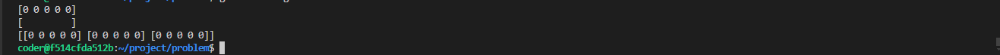

# Data Structure

1. Arrays
2. Linked Lists
3. Stacks
4. Queues
5. Hash Tables
6. Trees (Binary Trees, Binary Search Trees)
7. Heaps (Binary Heaps)
8. Graphs

## Go Unique Feature

> In Go, if you declare a variable without explicitly initializing it, the variable is automatically set to the zero value for its type. The zero value is a default value assigned to a variable of a specific type when it is declared but not explicitly initialized. For example, if you declare an int variable like this:

> The value of x will be initialized to 0.
In other languages like Javascript value of an uninitialized variable is undefined

**The zero value for each type is as follows:**
- int: 0
- float: 0.0
- bool: false
- string: "" (empty string)
- pointer: nil
- struct: all fields are set to the zero value for their respective types

---

## Array

---

### Declaring Arrays

```go
func main() {
	// Fixed Length = Array
	var v_int_arr [5]int 	
	fmt.Println(v_int_arr)

	// Fixed Length = Array
	var v_str_arr [10]string	
	fmt.Println(v_str_arr)

	var v_2d_arr [3][5]int
	fmt.Println(v_2d_arr)
}
```

**Output**


---

### Initializing Arrays

```go
func main() {
	// Fixed Length = Array
	var v_int_arr [5]int 	
	fmt.Println(v_int_arr)

	// Fixed Length = Array
	var v_str_arr [10]string	
	fmt.Println(v_str_arr)

	var v_2d_arr [3][5]int
	fmt.Println(v_2d_arr)

	// Fixed Length = Array
	var v_2d_arr_init = [3][5]int {}
	fmt.Println(v_2d_arr_init)

	// Fixed Length = Array
	var v_2d_arr_init_assigned = [3][5]int {	
		{1, 2, 3, 4, 5},
		{6, 7, 8, 9, 10},
		{11, 12, 13, 13, 15},
	}
	fmt.Println(v_2d_arr_init_assigned)
}
```

**Output**

---


