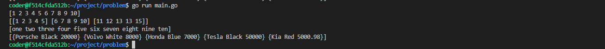

# Data Structure

1. Arrays
2. Linked Lists
3. Stacks
4. Queues
5. Hash Tables
6. Trees (Binary Trees, Binary Search Trees)
7. Heaps (Binary Heaps)
8. Graphs

---

## Array

---

### Declaring and Initializing Arrays

```go
// Fixed Length = Array
var nums [5]int 	
fmt.Println(nums)

// Fixed Length = Array
var strs [10]string	
fmt.Println(strs)

// Fixed Length = Array
var nested = [3][5]int {	
    {1, 2, 3, 4, 5},
    {6, 7, 8, 9, 10},
    {11, 12, 13, 13, 15},
}
fmt.Println(nested)
```

**Output**


---


